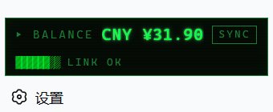

# dsh-balance-monitor

[English](#english) | [中文](#中文)

A DeepSeek Harness plugin that monitors your DeepSeek API account balance: official `/user/balance` snapshots, in-session queries, per-turn context injection, and a **Matrix-style sidebar badge**.



---

<a id="english"></a>
## English

### Features

| Capability | Description |
|---|---|
| 💬 In-session query | `ds_balance` tool: the agent can fetch the official balance snapshot anytime (`force: true` bypasses the cache) |
| 🔄 Per-turn injection | Fresh balance is injected into the model context before every turn (cache-only read, never blocks the conversation) |
| 🖥️ Sidebar badge | Matrix green-phosphor CRT style: `▸ BALANCE CNY ¥32.81 · LINK OK`, SYNC button for on-demand refresh, 30s auto polling, rail state collapses into a status lamp |
| 🔐 Zero-config key | Reuses `DEEPSEEK_API_KEY` from dsh's credential service (never written to disk, never logged) |
| 💱 Multi-currency | CNY/USD both listed (CNY first); amounts stay strings end-to-end, no float math |
| 🛡️ Rate-limit friendly | 30s TTL cache + request serialization (at most one in-flight request) + 5s timeout |

### Installation

```sh
# Option 1: install straight from GitHub (recommended)
dsh plugin --profile web add github:Rainronin/dsh-balance-monitor

# Option 2: clone and link-install locally (instant reload while developing)
git clone https://github.com/Rainronin/dsh-balance-monitor.git
cd dsh-balance-monitor
dsh plugin --profile web add .

# host-side changes require a restart
dsh web
```

> If pnpm blocks the `prepare` build script of a git-hosted plugin, add the
> printed key to `allowBuilds` in `$DSH_HOME/profiles/web/pnpm-workspace.yaml`
> and re-run.

The plugin joins `dsh.profile.bundles` automatically. Inspect the composed tree:

```sh
dsh --profile web --dump-config
```

### Usage

**In-session query** — just ask the agent:

```
查一下 DeepSeek 余额 / check my DeepSeek balance
```

**Sidebar badge** — at the sidebar footer next to Settings: `SYNC` force-refreshes
past the cache; polling refreshes every 30s; the collapsed (rail) state shows a
single status lamp (green = LINK OK, amber = degraded).

### Configuration

| Key | Default | Meaning |
|---|---|---|
| `apiKeyEnv` | `DEEPSEEK_API_KEY` | Credential reference (env var name); change for a different account |
| `cacheTtlMs` | `30000` | Cache lifetime in ms |
| `pollIntervalMs` | `30000` | Background polling interval in ms |
| `injectEveryTurn` | `true` | Whether to inject the balance into context every turn |
| `requestTimeoutMs` | `5000` | Official-API request timeout in ms |

Override in the profile's `cordis.patch.yml`:

```yaml
- id: balance-monitor
  config:
    cacheTtlMs: 10000
    pollIntervalMs: 10000
```

### Error semantics

| State | Behavior |
|---|---|
| No API key configured | Tool returns a Chinese hint; badge shows amber `NO KEY` |
| API failure + stale cache | Last snapshot is returned, marked "snapshot expired Ns (last refresh failed, retrying)" |
| API failure + no cache | The API error (HTTP status) is surfaced; badge shows amber `NO SIGNAL` |
| Injection-time API failure | Silent degradation: nothing injected, conversation unaffected |

### Architecture

```
host half (Node)
  BalanceRemoteService (service key `balance`; loader mounts the default-exported class)
  ├─ credential lookup → GET https://api.deepseek.com/user/balance → 30s TTL cache + serialization
  ├─ ds_balance tool + agent/pre-step injection + 30s polling
  └─ typert-host.js: hand-written TYPERT strict manifest (exported as ./typert,
      registered by typert-loader; api-gateway claims /api/balance/* via the strict definition)

browser half (client.tsx → lib/client.js, wrapped in the official __ModuleLoader__ shell)
  ├─ sidebar.footer.action slot: Matrix badge (wide/rail states)
  └─ data channel: direct calls over the official RPC protocol (POST /api/balance/<method>,
      client-request envelope), 30s polling + SYNC force refresh
```

The third-party Typert Remote client path (`$mount` contribution → namespace
service) failed silently in practice, so the badge talks the official RPC wire
protocol directly (dsh-host-apiproxy fetch-carrier envelope), while the host
side keeps the official TYPERT strict registration.

### Development

```sh
npm install            # toolchain (typescript/pnpm + type deps)
npm run build          # tsc (host ESM) + tsc (client CJS) + wrap-client shell + full-chain self-check
node diagnose.mjs      # local cordis integration diagnosis (mock services)
dsh plugin --profile web add .   # link install
```

Build notes: the browser half is compiled to CommonJS by tsc, then wrapped by
`wrap-client.mjs` into the official `window.__ModuleLoader__.load` registration
shell (same shape as official dsh-client-ui-* artifacts, served by
dsh-client-modules as `/plugins/<id>/client.js`); `verify-client.mjs` executes
the final bundle in a VM and validates registration, slot mounting, and the RPC
wire protocol end to end.

### Further reading

- [`UI设计构思.md`](UI设计构思.md) (Chinese): Matrix visual spec (phosphor CRT token system)

---

<a id="中文"></a>
## 中文

DeepSeek Harness 插件：DeepSeek API 账户余额监测——官方 `/user/balance` 接口快照 + 会话内查询 + 每轮上下文注入 + **Matrix 风格侧边栏徽章**。

### 功能

| 能力 | 说明 |
|---|---|
| 💬 会话内查询 | `ds_balance` 工具：agent 随时可查官方余额快照（`force: true` 穿透缓存） |
| 🔄 每轮注入 | 每轮对话前自动把最新余额放进模型上下文（只读缓存，绝不阻塞对话） |
| 🖥️ 侧边栏徽章 | Matrix 绿磷光 CRT 风格：`▸ BALANCE CNY ¥32.81 · LINK OK`，SYNC 按钮手动穿透刷新，30s 自动轮询，折叠态退化为状态灯 |
| 🔐 零配置密钥 | 复用 dsh 凭证服务里的 `DEEPSEEK_API_KEY`（不落盘、不打印、不缓存） |
| 💱 多币种 | CNY/USD 全列（CNY 优先），金额全程字符串透传，无浮点运算 |
| 🛡️ 限流友好 | 30s TTL 缓存 + 请求串行化（同一时刻最多一个在途请求）+ 5s 超时 |

### 安装

```sh
# 方式一：GitHub 直装（推荐）
dsh plugin --profile web add github:Rainronin/dsh-balance-monitor

# 方式二：本地 clone 后 link 安装（改代码即时生效，适合二次开发）
git clone https://github.com/Rainronin/dsh-balance-monitor.git
cd dsh-balance-monitor
dsh plugin --profile web add .

# host 半改动后重启生效
dsh web
```

> git 托管插件若被 pnpm 拦截 prepare 构建脚本，按提示把键加进
> `$DSH_HOME/profiles/web/pnpm-workspace.yaml` 的 `allowBuilds` 再重跑。

安装后插件自动进入 `dsh.profile.bundles` 层列表；检查配置树：

```sh
dsh --profile web --dump-config
```

### 使用

**会话内查询**——直接让 agent 查：

```
帮我查一下 DeepSeek 余额
```

**侧边栏徽章**——侧边栏底部（Settings 旁）：`SYNC` 按钮穿透缓存立即刷新；
30s 自动轮询；折叠态（rail）显示单色状态灯（绿 = LINK OK，琥珀 = 异常）。

### 配置

| 键 | 默认值 | 说明 |
|---|---|---|
| `apiKeyEnv` | `DEEPSEEK_API_KEY` | 凭证引用名（环境变量名），多账号时改这里 |
| `cacheTtlMs` | `30000` | 缓存有效期（毫秒） |
| `pollIntervalMs` | `30000` | 后台轮询间隔（毫秒） |
| `injectEveryTurn` | `true` | 是否每轮注入余额到模型上下文 |
| `requestTimeoutMs` | `5000` | 官方接口请求超时（毫秒） |

覆盖示例（profile 的 `cordis.patch.yml`）：

```yaml
- id: balance-monitor
  config:
    cacheTtlMs: 10000
    pollIntervalMs: 10000
```

### 错误语义

| 状态 | 表现 |
|---|---|
| 未配置 key | 工具返回中文提示；徽章显示琥珀 `NO KEY` |
| 接口失败 + 有旧缓存 | 返回最后一次快照并标注"快照已过期 Ns（最近一次刷新失败，自动重试中）" |
| 接口失败 + 无缓存 | 返回接口错误（HTTP 状态码）；徽章显示琥珀 `NO SIGNAL` |
| 每轮注入时接口失败 | 静默降级：不注入、不打断对话 |

### 架构

```
host 半（Node）
  BalanceRemoteService（服务键 balance，loader 行直接挂载 default 导出类）
  ├─ 凭证解析 → GET https://api.deepseek.com/user/balance → 30s TTL 缓存 + 串行化
  ├─ ds_balance 工具 + agent/pre-step 每轮注入 + 30s 轮询
  └─ typert-host.js：手写 TYPERT strict 元数据（./typert 导出，typert-loader 注册，
      api-gateway 按 strict 定义认领 /api/balance/* 端点）

browser 半（client.tsx → lib/client.js，__ModuleLoader__ 注册壳）
  ├─ sidebar.footer.action slot：Matrix 徽章（wide/rail 双态）
  └─ 数据通道：官方 RPC 公开协议直调（POST /api/balance/<method>，
      client-request 信封），30s 轮询 + SYNC 穿透刷新
```

第三方 Typert Remote 客户端链路（`$mount` 贡献 → 命名空间服务）在本机环境实测
静默失效，故徽章改用官方 RPC 公开协议直调（dsh-host-apiproxy fetch carrier 信封），
host 端严格保留官方 TYPERT strict 注册路径。

### 开发

```sh
npm install            # 装工具链（typescript/pnpm，含类型依赖）
npm run build          # tsc（host ESM）+ tsc（client CJS）+ wrap-client 包壳 + 全链路自检
node diagnose.mjs      # 本地 cordis 集成诊断（mock 服务验证工具注册与服务可见性）
dsh plugin --profile web add .   # link 安装
```

构建说明：browser 半由 tsc 编译成 CommonJS 后经 `wrap-client.mjs` 包进官方
`window.__ModuleLoader__.load` 注册壳（与官方 dsh-client-ui-* 产物同构，
由 dsh-client-modules 服务为 `/plugins/<id>/client.js`）；`verify-client.mjs`
在 VM 中执行最终 bundle，全链路验证注册、slot 挂载与 RPC 直调协议。

### 延伸阅读

- [`UI设计构思.md`](UI设计构思.md)：Matrix 视觉规范（磷光 CRT token 系统）
